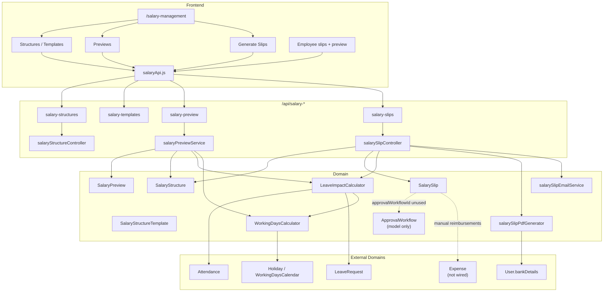
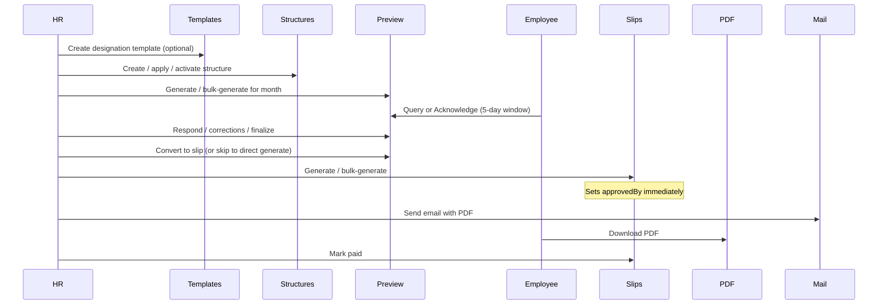
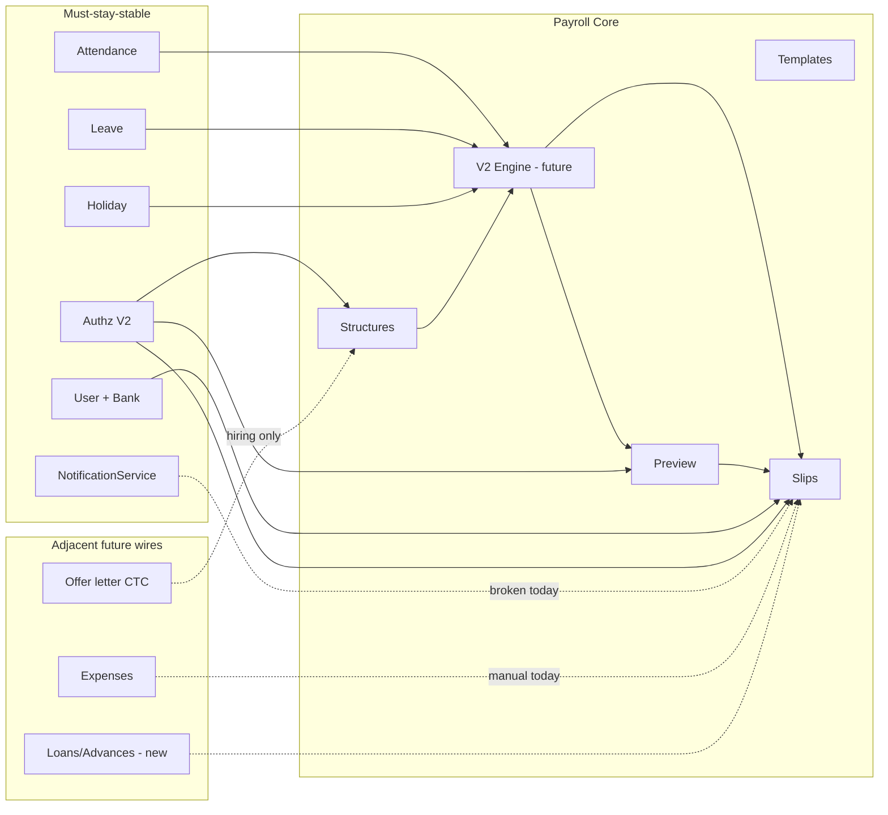

> **ARCHIVED — 2026-07-17.** Do not use for implementation. Active workspace: `docs/IMPLEMENTATION_PLANS/Payroll/`. Session pointer: `docs/ACTIVE_DEVELOPMENT.md`.

# Payroll System V2 — Discovery, Architecture & Implementation Plan

> **Status:** Discovery complete · Design frozen for review · **No implementation yet**  
> **Product:** We Alll Office ERP  
> **Date:** 2026-07-17  
> **Audience:** Engineering, HR Ops, Finance, Product  
> **Rule:** Evolve production payroll. Do **not** rewrite from scratch.

---

## 0. Executive Summary

We Alll Office already runs a **production payroll foundation**:

| Layer | What exists today |
|-------|-------------------|
| Structures | Per-employee `SalaryStructure` (draft → active → superseded) + dept/designation `SalaryStructureTemplate` |
| Preview | `SalaryPreview` with employee query / acknowledge / finalize |
| Slips | `SalarySlip` with unique `{employee, month, year}`, PDFKit PDF, email |
| Attendance impact | `LeaveImpactCalculator` + `WorkingDaysCalculator` (LOP = gross ÷ 30) |
| Permissions | `payroll.structure.manage`, `payroll.slip.manage`, `payroll.slip.view_self` |
| UI | HR Salary Management hub + employee My Compensation |

**What is missing for enterprise Payroll V2:** pay periods & lock, formula/component engine, statutory auto-calc (PF/ESI/PT/TDS/LWF), maker-checker approval (model exists, **API not wired**), loan/advance modules, retro/arrears engine, payroll freeze, audit immutability, bank export, SaaS multi-company, and reliable notifications.

**Recommended strategy:** **Strangler / additive evolution** — introduce a Payroll Engine beside current paths, dual-run calculations behind a feature flag, migrate slip generation month-by-month, keep existing APIs stable with versioned extensions.

---

## 1. Current Architecture

### 1.1 System diagram (as-is)



### 1.2 Inventory — Backend files

| Category | Path | Role |
|----------|------|------|
| **Models (active)** | `backend/src/models/salaryStructureModel.js` | Employee compensation structure |
| | `backend/src/models/salaryStructureTemplateModel.js` | Reusable templates |
| | `backend/src/models/salarySlipModel.js` | Monthly payslip |
| | `backend/src/models/salaryPreviewModel.js` | Pre-pay review |
| | `backend/src/models/approvalWorkflowModel.js` | Multi-stage approval (**no routes**) |
| **Models (dead)** | `backend/src/models/salaryModel.js` | Legacy — **never imported** |
| **Controllers** | `backend/src/controllers/salaryStructureController.js` | CRUD + activate |
| | `backend/src/controllers/salarySlipController.js` | Generate, bulk, PDF, email, reports, recalculate |
| **Routes** | `backend/src/routes/salaryStructureRoutes.js` → `/api/salary-structures` | |
| | `backend/src/routes/salarySlipRoutes.js` → `/api/salary-slips` | |
| | `backend/src/routes/salaryPreviewRoutes.js` → `/api/salary-preview` | Inline handlers + service |
| | `backend/src/routes/salaryTemplateRoutes.js` → `/api/salary-templates` | |
| **Services** | `backend/src/services/leaveImpactCalculator.js` | LOP / absence engine |
| | `backend/src/services/workingDaysCalculator.js` | Working days + holiday cache |
| | `backend/src/services/salaryPreviewService.js` | Preview orchestration |
| | `backend/src/services/salarySlipEmailService.js` | Nodemailer + PDF attach |
| | `backend/src/services/templateManagementService.js` | Template helpers (partially used) |
| **Utils** | `backend/src/utils/proRataSalaryCalculator.js` | Mid-month structure change |
| | `backend/src/utils/unpaidLeaveDeductionCalculator.js` | Parallel unpaid leave path |
| | `backend/src/utils/salarySlipPdfGenerator.js` | PDFKit payslip |
| | `backend/src/utils/offerLetterCalculations.js` | Hiring CTC only (not payroll run) |
| **Authz** | `backend/src/authz/permissionCatalog.js` | 3 payroll keys |
| | `backend/src/authz/legacyRoleMapping.js` | Role → payroll perms |
| **Tests** | `backend/tests/leaveImpactCalculator.*.test.js` | |
| | `backend/tests/workingDaysCalculator.*.test.js` | |
| **Scripts** | `backend/scripts/list-all-salary-structures.js` | Ops |
| | `backend/scripts/delete-*-salary-structure*.js` | Ops cleanup |
| **Cron** | `backend/src/config/cronJobs.js` | **No payroll jobs** |

### 1.3 Inventory — Frontend files

| Path | Role |
|------|------|
| `frontend/src/api/salaryApi.js` | All payroll HTTP clients |
| `frontend/src/pages/hr/SalaryManagement.jsx` | HR hub (tabs) |
| `frontend/src/pages/employee/MySalarySlips.jsx` | Employee slips + PDF |
| `frontend/src/pages/employee/MySalaryPreview.jsx` | Employee preview |
| `frontend/src/components/salary/SalaryStructures.jsx` | Structure list |
| `frontend/src/components/salary/SalaryStructureForm.jsx` | Create/edit |
| `frontend/src/components/salary/SalaryIncrementModal.jsx` | Revision via new structure |
| `frontend/src/components/salary/TemplateManagement.jsx` | Templates (+ route) |
| `frontend/src/components/salary/HRSalaryPreviewManagement.jsx` | HR preview ops (+ route) |
| `frontend/src/components/salary/GenerateSalarySlips.jsx` | Single/bulk generate |
| `frontend/src/components/salary/SalarySlipList.jsx` | HR slip list / email / mark paid |
| `frontend/src/components/salary/PayrollSummary.jsx` | Month summary report |
| `frontend/src/components/salary/SalaryPreview.jsx` | Employee preview detail |
| `frontend/src/components/salary/EmployeeSalaryInfo.jsx` | Profile embedded view |
| `frontend/src/components/salary/SalaryWidget.jsx` | **Unused** |
| `frontend/src/components/salary/SalaryStructureList.jsx` | Stub |

### 1.4 Route & permission map

| Frontend route | Permission | Fallback roles |
|----------------|------------|----------------|
| `/salary-management` | `payroll.slip.manage` | admin, superadmin, hr, accounts, manager |
| `/salary-preview-management` | `payroll.slip.manage` | same |
| `/salary-templates` | `payroll.structure.manage` | admin, superadmin, hr, manager |
| `/employee/salary-slips` | `payroll.slip.view_self` | employee+ |
| `/employee/salary-preview` | `payroll.slip.view_self` | employee+ |

**Sidebar note:** Finance → Salary Management uses `admin, superadmin, hr, manager` (accounts allowed on route but not always in sidebar).

---

## 2. Current Database

### 2.1 Collections (Mongoose models)

| Model | Typical collection | Purpose |
|-------|--------------------|---------|
| `SalaryStructure` | `salarystructures` | Active compensation definition |
| `SalaryStructureTemplate` | `salarystructuretemplates` | Template library |
| `SalarySlip` | `salaryslips` | Final monthly slip |
| `SalaryPreview` | `salarypreviews` | Pre-pay review artifact |
| `ApprovalWorkflow` | `approvalworkflows` | Unused multi-stage approval |
| `Salary` | `salaries` | Dead legacy schema |
| Related | `users`, `attendances`, `leaverequests`, `holidays`, `workingdayscalendars`, `expenses` | Inputs / adjacent |

### 2.2 SalaryStructure (key shape)

```
employee → User
effectiveFrom, effectiveTo
Earnings: basicSalary, hra, specialAllowance, transportAllowance, medicalAllowance, otherAllowances[]
Deductions: providentFund, professionalTax, tds, esi, otherDeductions[]
Computed (pre-save): grossSalary, totalDeductions, netSalary, ctc (= gross × 12)
status: draft | active | superseded
generatedFromTemplate, templateVersion, isActive
createdBy, approvedBy
```

**Indexes:** `{ employee, effectiveFrom }`, `{ status }`.

### 2.3 SalarySlip (key shape)

```
employee, salaryStructure
month, year, payPeriod, paymentDate
Attendance snapshot: totalWorkingDays, daysWorked, daysAbsent, paidLeaves, unpaidLeaves, weekends, holidays
earnings { basic…, bonus, overtime, arrears, reimbursements, incentives }
deductions { PF, PT, TDS, ESI, lossOfPay, unpaidLeaveDeduction, advances, loans, other[] }
totals + ytd
pdfUrl, status: draft|generated|sent|viewed|downloaded|paid|approved|rejected
previewId, approvalWorkflowId
proRataDetails, leaveImpactDetails, workingDaysCalculation
Unique: { employee, month, year }
```

### 2.4 SalaryPreview (key shape)

```
employee, month, year
workingDaysBreakdown, leaveImpact, salaryBreakdown
employeeQueries[], reviewDeadline (+5 days)
status: generated → under_review | query_raised → acknowledged → finalized
finalSalarySlip → SalarySlip
```

### 2.5 ApprovalWorkflow (designed, not exposed)

```
type: salary_approval | bulk_approval | individual_review
stages: hr_review → finance_approval → management_signoff (2-day deadlines)
salarySlips[], currentStage, overallStatus
auditTrail[], notifications[]
```

### 2.6 User payroll-adjacent fields

- `bankDetails` (accountNumber `select: false`)
- Legacy `salary` Number (`select: false`)
- `documents.salarySlips[]` (manual uploads — separate from generated slips)
- `notificationPreferences.categories.salary`
- Gov IDs for payroll: PAN, UAN, ESIC (profile)

### 2.7 Relationships

```
User 1──* SalaryStructure (history; one active)
User 1──* SalaryPreview (per month/year)
User 1──* SalarySlip (unique per month/year)
SalaryStructureTemplate 1──* SalaryStructure (generatedFromTemplate)
SalaryPreview ──1 SalarySlip (optional convert)
SalarySlip ──? ApprovalWorkflow (field exists; never created via API)
SalaryStructure ← LeaveImpactCalculator (read-only input)
Attendance + LeaveRequest → LeaveImpactCalculator → LOP on Preview/Slip
Holiday → WorkingDaysCalculator → working days
Expense ✗ not linked to slip.reimbursements
Loan/Advance ✗ no collections; slip fields are manual amounts only
```

---

## 3. Current APIs

### 3.1 `/api/salary-structures`

| Method | Path | Permission | Handler |
|--------|------|------------|---------|
| POST | `/` | structure.manage | create |
| GET | `/` | structure.manage | list |
| GET | `/employee/:id/active` | manage **or** own + view_self | active |
| GET | `/employee/:id/history` | structure.manage | history |
| GET | `/:id` | structure.manage | by id |
| PUT | `/:id` | structure.manage | update (active → new draft) |
| PUT | `/:id/activate` | structure.manage | activate + supersede |
| DELETE | `/all` | structure.manage (admin/superadmin) | wipe |
| DELETE | `/:id` | structure.manage | delete |

### 3.2 `/api/salary-slips`

| Method | Path | Permission | Notes |
|--------|------|------------|-------|
| POST | `/generate` | slip.manage | Single |
| POST | `/generate-bulk` | slip.manage | All active employees |
| PUT | `/:id/recalculate` | slip.manage | Refresh LOP |
| POST | `/bulk-recalculate` | slip.manage | |
| GET | `/`, `/employee/:id`, `/my-slips`, `/:id` | manage / view_self | |
| PUT | `/:id` | slip.manage | Manual earnings/deductions |
| PUT | `/:id/mark-paid` | slip.manage | |
| DELETE | `/:id` | slip.manage | Draft only |
| GET | `/:id/download-pdf` | view_self | Stream PDF |
| POST | `/:id/send-email`, `/send-bulk-emails` | slip.manage | |
| GET | `/reports/payroll-summary` | slip.manage | |
| GET | `/stats/overview` | slip.manage | |

### 3.3 `/api/salary-preview`

| Method | Path | Actor |
|--------|------|-------|
| POST | `/generate`, `/bulk-generate` | HR |
| GET | `/working-days-info` | HR (mid-month) |
| GET | `/my-preview/:month/:year` | Employee |
| POST | `/:id/query`, `/:id/acknowledge` | Employee |
| POST | `/:id/query/:i/respond`, finalize, corrections, convert-to-slip | HR |
| GET | `/month|attention|statistics/:month/:year` | HR |
| DELETE | `/:previewId` | HR |

### 3.4 `/api/salary-templates`

CRUD + `/:id/apply`, `/:id/bulk-apply`, `/:id/usage-stats`, `/:id/versions` — all `payroll.structure.manage`.

### 3.5 Frontend API coverage gaps

Defined in `salaryApi.js` but **not wired in UI:** recalculate / bulk-recalculate, structure deleteAll, some GET-by-id helpers.  
HR slip list has **email + mark paid** but **no PDF download** button (employee side does).

---

## 4. Current Workflow

### 4.1 Happy path (HR ops)



### 4.2 Structure lifecycle

1. Create as `draft` (or create active).  
2. Edit draft in place; editing `active` creates a **new draft version**.  
3. `activate` → set `approvedBy`, mark previous `superseded`.  
4. Increment UI creates a new structure with new `effectiveFrom`.

### 4.3 Preview lifecycle

`generated` → (`query_raised` ↔ `under_review`) → `acknowledged` → `finalized` → convert to slip.

Deadline: **generation + 5 days**. Finalization can force after expiry (controller rules).

### 4.4 Slip status lifecycle (as used)

Typically: create as generated/approved-ish → `sent` (email) → `viewed`/`downloaded` → `paid`.  
Statuses `approved`/`rejected` exist for workflow but workflow API is missing.

---

## 5. Current Calculations (step-by-step)

### 5.1 Where salary “starts”

1. HR defines a **SalaryStructure** (or applies a **Template**).  
2. Pre-save computes:

```
gross = basic + hra + special + transport + medical + Σ otherAllowances
totalDeductions = PF + PT + TDS + ESI + Σ otherDeductions
net = gross − totalDeductions
ctc = gross × 12   ← employer contributions NOT included
```

3. Template may auto-set `hra` / `providentFund` from `% of basic` (`hraPercentage`, `pfPercentage`). Default template PT = **200**.  
4. **Statutory formulas are not applied at runtime** — PF/ESI/TDS on structure are **stored amounts**.

### 5.2 Working days

`WorkingDaysCalculator`:

- Default pattern: **6-day** (Sundays off). Optional **5-day** (Sat+Sun).  
- Subtract holidays from `Holiday` (+ optional department).  
- Cache into `WorkingDaysCalendar`.

### 5.3 How attendance / leave affect pay (LOP)

`LeaveImpactCalculator.calculateLeaveDeduction`:

1. `perDaySalary = grossSalary / 30` (fixed divisor — **not** calendar days, **not** working days).  
2. Load **approved** leaves for month.  
3. All leave types are **paid** except: `unpaid`, `loss_of_pay`, `lop`, `lwp`, `leave_without_pay`.  
4. For each calendar day up to `min(monthEnd, today)`: skip Sunday / non-working Saturday / holiday / approved leave; if **no attendance** → **absent** (unpaid).  
5. `totalUnpaidDays = absentDays + explicitUnpaidLeaves`.  
6. `deductionAmount = round(totalUnpaidDays × perDaySalary)`.

**Important:** Full monthly gross is paid; absences reduce via **deduction**, not by scaling earnings to days worked (except unused `calculateProportionalSalary` helper).

### 5.4 Overtime

- Attendance may track overtime **hours**.  
- Slip/preview overtime is a **manual rupee field** (`bonus`/`overtime` in body or corrections).  
- **No automatic OT rate × hours.**

### 5.5 Unpaid leave — second path (risk)

On slip generate, after LOP from LeaveImpactCalculator, controller may also run `unpaidLeaveDeductionCalculator` and set `deductions.unpaidLeaveDeduction`. Both can be non-zero → **possible double deduction**.

### 5.6 Pro-rata (mid-month structure change)

`proRataSalaryCalculator`:

- Splits month by calendar days around `effectiveFrom`.  
- Expects structures shaped as `{ earnings: {}, deductions: {} }`.  
- Live structures store **flat fields** → mapping often yields empty/zero pro-rata components; fallback uses full structure amounts.

### 5.7 Preview calculation

Same structure earnings + leave LOP + optional additionalData (bonus, OT, arrears, reimbursements, incentives, advances, loans). Net = gross − deductions.

### 5.8 Slip generation calculation

1. Load active structure.  
2. Optional pro-rata check.  
3. `calculateAttendance` → LOP.  
4. Build earnings from structure (+ request extras).  
5. Build deductions from structure + LOP + optional unpaidLeaveDeduction + advances/loans.  
6. Model pre-save: sum earnings/deductions → net.  
7. Attempt notification (broken — see §7).  
8. Persist unique slip for month.

### 5.9 PDF

`salarySlipPdfGenerator.js` (PDFKit) → `uploads/salary-slips/salary-slip-{employeeId}-{month}-{year}.pdf`. Masks bank account (last 3 digits).

### 5.10 Email

`salarySlipEmailService` attaches PDF via nodemailer.

### 5.11 Reports

`getPayrollSummary`: aggregates slips for month/year by department and status (gross/net/deductions). No statutory registers, no bank file, no cost center P&L.

### 5.12 Finalization

No formal **pay period lock**. “Final” today means: preview finalized + slip exists + optionally marked `paid`. Slips remain recalculable/editable unless UI/process discipline prevents it.

---

## 6. Current Limitations

| # | Area | Limitation | Severity |
|---|------|------------|----------|
| 1 | Architecture | Dual LOP engines (`lossOfPay` + `unpaidLeaveDeduction`) | **Critical** |
| 2 | Architecture | Dead `salaryModel.js`; unused `ApprovalWorkflow` API | High |
| 3 | Architecture | Preview routes vs Slip controller logic duplicated | High |
| 4 | Calculation | Fixed /30 LOP; ignores policy choice (calendar/working days) | High |
| 5 | Calculation | Pro-rata shape mismatch with flat structure | High |
| 6 | Calculation | CTC = gross×12 (no employer PF/ESI/gratuity) | Medium |
| 7 | Statutory | No PF wage ceiling, ESI eligibility, PT slabs, TDS engine, LWF | **Critical** for compliance |
| 8 | Components | Fixed fields; `otherAllowances` only weak extension | High |
| 9 | Formulas | No formula language; % only on templates for HRA/PF | High |
| 10 | Periods | No `PayrollPeriod` / calendar / cutoff / lock / freeze | **Critical** |
| 11 | Approval | Model exists; generate auto-sets `approvedBy`; no maker-checker | High |
| 12 | Retro | Arrears are manual numbers; no revision-driven retro run | High |
| 13 | OT / Night / Weekend | No rules engine | Medium |
| 14 | Loan / Advance | Fields only; no ledger / EMI schedule | High |
| 15 | Expense | Reimbursements not pulled from Expense module | Medium |
| 16 | Notifications | `sendSalarySlipNotification` missing; no salary type in notification enum | High |
| 17 | Cron | No auto payroll / reminder / deadline jobs | Medium |
| 18 | Audit | No immutable payroll event log; slip editable after generate | High |
| 19 | Rollback | No unlock/reopen with reason + audit | High |
| 20 | Bulk | Sequential employee loops; no job queue / progress | Medium |
| 21 | Security | Bank details masking inconsistent; wipe-all structures endpoint | High |
| 22 | Multi-company | Single-tenant assumptions; no companyId on payroll docs | Medium (SaaS future) |
| 23 | Branch/Location/Shift | Not modeled for pay rules | Medium |
| 24 | Reports | Only summary; no salary register, PF/ESI returns, bank NEFT file | High |
| 25 | YTD | Schema exists; population reliability unclear / incomplete | Medium |
| 26 | Frontend | Unused widget/stub; HR PDF download gap; accounts sidebar mismatch | Low–Med |
| 27 | Performance | N+1 leave/attendance queries per employee in bulk | Medium |
| 28 | Timezone | LeaveImpact uses `new Date()` — not IST utils (project rule) | Medium |
| 29 | Revision history | Structure history exists; no formal revision entity / reason codes | Medium |
| 30 | Testing | Calculators tested; slip generate / pro-rata / email not fully covered | High |

---

## 7. Dependency Map



| Dependency | Coupling today | V2 requirement |
|------------|----------------|----------------|
| Attendance | Hard (absence = LOP) | Configurable attendance rules; late/half-day |
| Leave | Hard (paid vs unpaid types) | Leave policy codes mapped to pay impact |
| Holiday / calendar | Hard | Pay calendar + location calendars |
| User bank / IDs | Soft (PDF/email) | Bank export + validation |
| Expense | None | Optional auto-include approved reimbursements |
| Authz | Hard | Expand permission keys |
| Notifications | Intended hard, broken | Fix enum + NotificationService methods |
| Offer letter | Parallel CTC math | Align component names when hiring → structure |

---

## 8. Risk Analysis

| Risk | Impact | Likelihood | Mitigation |
|------|--------|------------|------------|
| Changing LOP formula mid-year | Wrong net pay / disputes | High if rushed | Feature flag; parallel calc; HR sign-off on sample set |
| Double LOP already in prod | Over-deduction | Medium | Immediate hotfix branch **before** V2 features |
| Editing paid slips | Audit / compliance failure | Medium | Lock period; immutable versions |
| Statutory miscalc (PF/ESI/TDS) | Legal exposure | High if enabled wrong | Config tables + CA validation; start advisory mode |
| Breaking unique slip constraint | Failed runs | Medium | Soft versions + periodId; keep unique on published |
| Bulk timeout | Ops failure | High at scale | Job queue + chunking |
| Pro-rata bug | Wrong mid-month pay | High | Fix adapter before relying on pro-rata |
| Notification spam | UX noise | Low | Prefer categories.salary prefs |
| Multi-company premature | Scope explosion | Low | Schema `companyId` nullable now; enforce later |
| Rewrite temptation | Regression | High | Strangler pattern mandatory |

**Production non-negotiables**

1. Never break existing `/api/salary-*` contracts without versioning.  
2. Never delete historical slips.  
3. Never push unfinished payroll to `main`.  
4. Every calculation change needs golden-file fixtures from real anonymized samples.

---

## 9. Payroll System V2 — Target Design

### 9.1 Design principles

1. **One Payroll Engine** — single source of truth for calc (preview, slip, retro).  
2. **Configuration over code** — components, formulas, rules, calendars.  
3. **Period-centric** — all runs belong to a `PayrollPeriod`.  
4. **Immutable published results** — corrections via revision / off-cycle / reverse.  
5. **Maker-checker** — wire and extend existing `ApprovalWorkflow`.  
6. **Additive migration** — dual-run, feature flags, month cutover.  
7. **India-first compliance** — PF, ESI, PT, LWF, TDS extensible; amounts auditable.  
8. **SaaS-ready schema** — optional `companyId` / `branchId` without requiring multi-tenant UI now.

### 9.2 Architectural approaches (choose one)

| Approach | Description | Pros | Cons | Verdict |
|----------|-------------|------|------|---------|
| **A. Big-bang rewrite** | New collections, new APIs, deprecate old | Clean | Extreme prod risk | ❌ Reject |
| **B. Strangler / dual-run (recommended)** | New engine + period; old APIs call engine; flag per company/month | Safe, incremental | Temporary dual paths | ✅ **Recommend** |
| **C. Patch-only** | Fix bugs inside current controllers | Fast | Never reaches enterprise goals | ❌ Insufficient alone |

**Recommended: Approach B.**

### 9.3 Target domain model

```
Company / Branch / Location (future-ready ids)
  └── PayrollCalendar (year) → PayrollPeriod (month/cycle)
        └── PayrollRun (draft|processing|pending_approval|approved|locked|paid)
              └── PayrollResult / SalarySlipV2 (or versioned SalarySlip)
EmployeeCompensation (revisioned structure)
  ← SalaryComponentAssignment (from Component Catalog + Formula)
PayRuleSet (attendance, leave, OT, night, weekend)
Loan / Advance ledgers → recovery lines
StatutoryConfig (PF/ESI/PT/LWF/TDS)
AuditEvent (immutable)
```

### 9.4 Recommended Payroll Engine

**Module:** `backend/src/services/payroll/PayrollEngine.js`

**Pipeline (ordered stages):**

1. **Resolve period** — open period, cutoff, working calendar, location.  
2. **Resolve compensation** — effective structure(s) for period (supports mid-period revision).  
3. **Resolve attendance snapshot** — days present, absent, OT hours, night hours (from Attendance).  
4. **Resolve leave impact** — paid/unpaid/half-day per Leave Rules map.  
5. **Build earnings** — evaluate component formulas (basic, HRA, allowances, OT pay, bonus, incentives, arrears, reimbursements).  
6. **Build statutory deductions** — PF, ESI, PT, LWF, TDS (config-driven).  
7. **Build other deductions** — loan EMI, advance recovery, LOP, custom.  
8. **Net & totals** — rounding policy (banker’s / round half up to ₹).  
9. **YTD** — from locked prior slips only.  
10. **Persist result** — with `engineVersion`, `inputSnapshot`, `formulaTrace`.

**Output contract (stable):**

```js
{
  employeeId, periodId, engineVersion,
  inputs: { structureId, attendance, leaves, overrides },
  earnings: [{ code, name, amount, taxable, formula }],
  deductions: [{ code, name, amount, statutory, formula }],
  totals: { gross, totalDeductions, net, employerCost },
  traces: [...], // for audit / dispute
  warnings: [...]
}
```

### 9.5 Recommended Formula Engine

**Module:** `backend/src/services/payroll/FormulaEngine.js`

- Safe expression evaluator (**no** `eval` on raw user strings).  
- Allowlisted functions: `min`, `max`, `round`, `if`, `percent`.  
- Allowlisted variables: `BASIC`, `GROSS`, `HRA`, `CTC`, `DAYS_IN_PERIOD`, `PAID_DAYS`, `LOP_DAYS`, `OT_HOURS`, `PF_WAGE`, custom component codes.  
- AST compile → execute with caps (depth, length).  
- Unit tests: golden vectors for each formula template.

**Example components:**

| Code | Formula |
|------|---------|
| `HRA` | `percent(BASIC, 40)` |
| `PF_EE` | `min(percent(PF_WAGE, 12), ceiling)` |
| `LOP` | `round(GROSS / 30 * LOP_DAYS)` (configurable divisor) |

### 9.6 Recommended Salary Component Engine

**Collections:**

1. **`SalaryComponent`** — catalog: code, name, type (`earning|deduction|employer`), taxable, statutory, calcMethod (`fixed|formula|manual|attendance`), defaultFormula, active.  
2. **`SalaryStructureV2` / evolution of current** — assignments of components with amounts/formulas + effective dates.  
3. **Templates** — company / department / designation / branch / location / shift (priority merge).

**Migration:** Map existing flat fields → component codes (`BASIC`, `HRA`, `SA`, `TA`, `MA`, `PF_EE`, `PT`, `TDS`, `ESI_EE`). Keep flat fields as computed denormalization for old UI until UI cutover.

### 9.7 Recommended Approval Engine

**Wire existing `ApprovalWorkflow`:**

| Stage | Role / permission | Action |
|-------|-------------------|--------|
| `hr_review` | `payroll.run.approve_hr` | Validate exceptions, LOP, overrides |
| `finance_approval` | `payroll.run.approve_finance` | Totals, statutory, bank file |
| `management_signoff` | `payroll.run.approve_mgmt` | Optional for large runs |

**Maker-checker rules:**

- Maker cannot approve own run (except superadmin emergency with audit).  
- Locked period: no edit without unlock permission + reason.  
- Preview employee ack remains **advisory**, not a substitute for finance approval.

### 9.8 Recommended Audit System

**`PayrollAuditLog`** (append-only):

```
{ entityType, entityId, action, before, after, actor, at, ip, reason, periodId }
```

Actions: `structure.activate`, `period.lock`, `period.unlock`, `run.generate`, `run.approve`, `slip.revise`, `override.apply`, `email.send`, `mark.paid`.

Never update/delete audit rows. Align with procurement audit pattern already in project rules.

### 9.9 Recommended Background Jobs

| Job | Schedule | Purpose |
|-----|----------|---------|
| `payroll.period.remind` | Daily | Open period approaching cutoff |
| `payroll.preview.deadline` | Daily | Notify pending employee acks |
| `payroll.approval.escalate` | Hourly | Stage deadline exceeded |
| `payroll.bulk.process` | On demand (queue) | Chunked generate |
| `payroll.ytd.rebuild` | Nightly / on lock | Consistency |
| `payroll.statutory.refresh` | On config change | Cache wage ceilings |

Use existing cron framework in `cronJobs.js`; prefer job table for long bulk.

### 9.10 Recommended Notifications

1. Add notification types: `salary_preview_ready`, `salary_query_response`, `salary_slip_generated`, `salary_slip_paid`, `payroll_approval_required`, `payroll_locked`.  
2. Implement missing `NotificationService` methods; respect `categories.salary`.  
3. Keep email path for slips; add optional email for approval tasks.

### 9.11 Recommended Reports & Analytics

| Report | Consumer |
|--------|----------|
| Salary Register | Finance |
| Department / Company cost | Leadership |
| LOP / Attendance impact | HR |
| Statutory: PF, ESI, PT worksheets | Compliance |
| Bank transfer file (NEFT/CSV) | Accounts |
| Variance vs prior month | Finance |
| Employee cost analysis | HoD / Finance |
| Payroll Analytics dashboard | HR/Admin |

### 9.12 UI changes (high level)

Keep Bootstrap + existing Salary Management hub; extend tabs:

1. **Pay Periods** — open / freeze / lock / unlock.  
2. **Components & Formulas** — builders.  
3. **Runs** — generate, exceptions queue, approve.  
4. **Structures** — V2 assignments (compat with current form).  
5. **Loans / Advances** — new.  
6. **Reports** — expand beyond PayrollSummary.  
7. Employee: keep slips + preview; add loan balances later.

### 9.13 Permission changes

| New key | Purpose |
|---------|---------|
| `payroll.period.manage` | Open/close/lock periods |
| `payroll.period.unlock` | Emergency unlock |
| `payroll.component.manage` | Component catalog |
| `payroll.run.process` | Generate / recalculate |
| `payroll.run.approve_hr` | Stage 1 |
| `payroll.run.approve_finance` | Stage 2 |
| `payroll.run.approve_mgmt` | Stage 3 |
| `payroll.report.view` | Sensitive reports |
| `payroll.bank.export` | Bank file |
| `payroll.audit.view` | Audit trail |

Keep existing three keys for backward compatibility; map legacy roles in `legacyRoleMapping.js`.

---

## 10. Migration Strategy

### Phase 0 — Stabilize (hotfix, before V2 features)

1. Eliminate double LOP (single deduction path).  
2. Fix pro-rata adapter (flat structure ↔ earnings/deductions).  
3. Fix NotificationService + enum.  
4. Soft-deprecate `DELETE /salary-structures/all` or superadmin-only with confirmation log.  
5. Add regression fixtures for 5–10 anonymized employee months.

### Phase 1 — Foundations (non-breaking)

1. Add `PayrollPeriod`, `SalaryComponent`, nullable `companyId`/`branchId`.  
2. Introduce PayrollEngine behind `PAYROLL_V2_ENGINE=false`.  
3. Dual-run: log differences; do not persist V2 nets.  
4. Wire ApprovalWorkflow read APIs (no forced use yet).

### Phase 2 — Period + Lock

1. Require period for new generates when flag on.  
2. Lock after finance approval.  
3. Old generate endpoints create/use period automatically for current month.

### Phase 3 — Components + Formulas

1. Migrate structures to component assignments.  
2. UI dual-mode.  
3. Templates expand to dept/designation/branch.

### Phase 4 — Statutory + Recoveries

1. Config-driven PF/ESI/PT/LWF; TDS advisory then enforced.  
2. Loan/Advance modules → auto recovery lines.

### Phase 5 — Bulk + Jobs + Reports + Bank export

### Phase 6 — Multi-company readiness & SaaS flags

**Cutover rule:** One closed month stays on V1 calc forever (immutable). Next open month can enable V2.

---

## 11. Recommended Database Changes

### 11.1 New collections

| Collection | Purpose |
|------------|---------|
| `payrollperiods` | Cycle, status (`open|frozen|processing|locked|paid|reopened`), cutoff, calendar |
| `payrollruns` | Batch run metadata + approvalWorkflowId |
| `salarycomponents` | Component catalog |
| `salaryformulas` | Named formulas / versions |
| `payrulesets` | Attendance/leave/OT/night/weekend rules |
| `loans` / `advances` | Principal, EMI, balance, recoveries |
| `payrollauditlogs` | Append-only |
| `statutoryconfigs` | Effective-dated PF/ESI/PT/LWF/TDS |

### 11.2 Evolutions (non-breaking)

| Existing | Change |
|----------|--------|
| `SalaryStructure` | Add `components[]`, `revisionNumber`, `revisionReason`, keep flat fields synced |
| `SalarySlip` | Add `periodId`, `runId`, `engineVersion`, `inputSnapshot`, `isLocked`, `version`, `supersedes` |
| `SalaryPreview` | Add `periodId`, `engineVersion`, `formulaTrace` |
| `ApprovalWorkflow` | No schema break; start creating documents |
| `User` | Optional `branchId`, `locationId`, `shiftId` when ready |

### 11.3 Indexes

- `{ periodId, employee }` unique for published slip version 1  
- `{ companyId, year, month }` on periods  
- `{ employee, status }` on loans  
- TTL none on audit

---

## 12. Recommended API Changes

### 12.1 Compatibility policy

- Keep all current `/api/salary-*` routes.  
- Add `/api/payroll/*` for V2 resources.  
- Controllers gradually delegate calc to PayrollEngine.

### 12.2 New API surface (summary)

| Prefix | Resources |
|--------|-----------|
| `/api/payroll/periods` | CRUD, freeze, lock, unlock |
| `/api/payroll/runs` | create, process, status, approve, reject |
| `/api/payroll/components` | catalog CRUD |
| `/api/payroll/formulas` | validate, versions |
| `/api/payroll/rules` | attendance/leave/OT rules |
| `/api/payroll/loans`, `/api/payroll/advances` | lifecycle |
| `/api/payroll/reports/*` | register, statutory, bank-export |
| `/api/payroll/audit` | query |
| `/api/payroll/approvals` | list mine, act on stage |

### 12.3 Response shape

Align with project standard:

```json
{ "success": true, "data": {}, "message": "..." }
```

Errors: `{ "success": false, "error": "..." }` / existing `{ message }` during transition.

---

## 13. Recommended UI Changes

| Screen | Change |
|--------|--------|
| Salary Management | Add Periods, Runs, Exceptions, Approvals tabs |
| Template Management | Multi-scope templates + component picker |
| Structure Form | Component builder + formula preview |
| Preview Management | Show formula traces / warnings |
| Generate Slips | Bind to open period; progress for bulk |
| Payroll Summary | Expand reports; export CSV |
| New: Loans/Advances | HR + employee balance view |
| My Salary Slips | Show locked badge; bank download unchanged |
| Permissions UI | New payroll keys |

Preserve Bootstrap 5 / react-icons / no Redux.

---

## 14. Recommended Testing Strategy

### 14.1 Layers

| Layer | Focus |
|-------|-------|
| Unit | FormulaEngine, statutory calculators, LOP rules, rounding |
| Property | Working days / leave overlap (extend existing tests) |
| Integration | Generate preview → approve → lock → PDF |
| Golden files | Anonymized month fixtures; assert nets |
| Regression | V1 vs V2 dual-run diff = 0 within ₹1 |
| Authz | Every new route permission |
| Load | Bulk 500 employees chunked |

### 14.2 Minimum exit criteria per feature branch

- Unit tests green for new engine pieces.  
- Dual-run report for sample month reviewed by HR.  
- No existing employee slip download regression.  
- Feature flag off by default on `main` deploy.

---

## 15. Implementation Roadmap — Git Feature Branches

Each branch is **independently deployable** with flag off / backward compatible.

| Branch | Scope | Depends on | Production risk if merged flag-off |
|--------|-------|------------|-------------------------------------|
| `feature/payroll-v2-analysis` | This plan + inventory + golden fixture stubs | — | None (docs only) |
| `feature/payroll-v2-hotfix-calc` | Double LOP, pro-rata adapter, notification fix | — | Low (bugfix) |
| `feature/payroll-v2-pay-period` | PayrollPeriod model/APIs/UI skeleton | analysis | Low |
| `feature/payroll-v2-engine` | PayrollEngine dual-run logging | period | Low |
| `feature/payroll-v2-components` | Component catalog + structure mapping | engine | Low–Med |
| `feature/payroll-v2-formula-engine` | Safe formulas + template % migration | components | Med |
| `feature/payroll-v2-approval` | Wire ApprovalWorkflow + permissions | engine, period | Med |
| `feature/payroll-v2-bulk-processing` | Queue/chunked runs + progress | engine | Med |
| `feature/payroll-v2-audit` | Audit log + lock immutability | period, approval | Med |
| `feature/payroll-v2-statutory` | PF/ESI/PT/LWF/TDS configs | formula | High (enable carefully) |
| `feature/payroll-v2-loans-advances` | Ledgers + recovery | engine | Med |
| `feature/payroll-v2-reports` | Register, cost, bank export | audit, lock | Med |
| `feature/payroll-v2-ui` | Hub tabs polish, employee UX | prior UI stubs | Med |
| `feature/payroll-v2-testing` | Golden suite + load + dual-run CI | engine+ | Low |
| `feature/payroll-v2-retro-arrears` | Revision-driven retro | engine, components | High |

**Suggested merge order:** analysis → hotfix → period → engine → components → formula → approval → audit → bulk → statutory → loans → reports → UI → retro → testing hardening.

**Never merge to `main` without:** flag default off, HR sample sign-off, and PR review.

---

## 16. Detailed Branch Deliverables (zero ambiguity)

### 16.1 `feature/payroll-v2-analysis` (this document)

- [x] Full discovery  
- [ ] Optional: `docs/payroll/CURRENT_PAYROLL_INVENTORY.md` short link index  
- [ ] Golden fixture folder `backend/tests/fixtures/payroll/` (anonymized JSON) — **no engine yet**

### 16.2 `feature/payroll-v2-hotfix-calc`

**Files likely touched:**

- `salarySlipController.js` — single LOP path  
- `proRataSalaryCalculator.js` + adapter from flat structure  
- `notificationModel.js` + `NotificationService`  
- Unit tests for generate path with unpaid leave

**Acceptance:** Generating a slip with unpaid leave does not double-count; mid-month revision pro-rata uses real component amounts; employee gets in-app notification when configured.

### 16.3 `feature/payroll-v2-pay-period`

**Deliver:**

- Model `payrollPeriodModel.js`  
- Routes `/api/payroll/periods`  
- UI tab: list/open/freeze  
- Slip generate (flag on) requires open period  

**Acceptance:** Can open July 2026 period; cannot generate into locked period.

### 16.4 `feature/payroll-v2-engine`

**Deliver:**

- `PayrollEngine.processEmployee({ employeeId, periodId, overrides })`  
- Feature flag `PAYROLL_V2_ENGINE`  
- Diff logger vs legacy calc  

**Acceptance:** Diff report endpoint for admins; no change to stored nets when flag off.

### 16.5 `feature/payroll-v2-components` + `formula-engine`

**Deliver:** catalog CRUD, map BASIC/HRA/…, formula validate API, structure form dual UI.

**Acceptance:** Template with `pfPercentage` still produces same PF amount as today for fixture set.

### 16.6 `feature/payroll-v2-approval`

**Deliver:** create workflow on run submit; stage action APIs; UI inbox; cannot mark paid unless approved (flag).

### 16.7 `feature/payroll-v2-bulk-processing`

**Deliver:** job document + worker; progress %; resume failed employees.

### 16.8 `feature/payroll-v2-audit`

**Deliver:** audit collection; lock sets `isLocked`; unlock requires reason + `payroll.period.unlock`.

### 16.9 `feature/payroll-v2-reports` + UI + testing

As named; bank CSV format agreed with Accounts before code freeze.

---

## 17. Feature Capability Matrix (V1 vs V2)

| Capability | V1 today | V2 target |
|------------|----------|-----------|
| Flexible components | Partial (`other*`) | Full catalog |
| Allowance/Deduction builder | UI forms fixed | Builder |
| Formula builder | HRA/PF % only | Safe formula engine |
| Payroll period / calendar | Month ints only | First-class period |
| Salary revision history | Structure history | Revision + reason + retro |
| Effective dates | Yes | Yes + mid-period split fixed |
| Multi structures / templates | Dept/designation | + company/branch/location/shift |
| Attendance / leave / holiday rules | Hardcoded | PayRuleSet |
| OT / night / weekend rules | Manual ₹ | Rule-based |
| Auto / bulk payroll | Bulk sync loop | Queued auto |
| Lock / unlock / freeze | No | Yes |
| Maker-checker / multi-level | Model only | Wired |
| Version history / rollback | Weak | Immutable + revise |
| Retro / arrear | Manual | Engine |
| Bonus / incentive / commission | Manual fields | Components + optional CRM later |
| Reimbursement | Manual | Optional Expense link |
| Loan / advance recovery | Manual | Ledger |
| Tax / PF / ESI / PT / LWF | Stored amounts | Config engines |
| Bank export | No | Yes |
| Salary register / analytics | Summary only | Full suite |
| Audit logs | Minimal | Append-only |
| PDF / email / notifications | PDF+email; notif broken | All fixed |
| API / mobile / multi-company ready | API yes | + mobile DTOs + companyId |

---

## 18. Open Decisions (resolve before coding engine)

These are product decisions — defaults recommended for We Alll:

| Decision | Options | Recommendation |
|----------|---------|----------------|
| LOP divisor | 30 / calendar days / paid days | Keep **30** as default policy; make configurable per company |
| CTC definition | Gross×12 vs Gross+employer | Move to **Gross + employer statutory** in V2 displays; keep legacy field for compat |
| Employee preview | Required before pay? | Keep **optional advisory**; finance approval is mandatory for lock |
| TDS | Full slabs vs fixed monthly | Start **fixed/manual + YTD**; slabs in later statutory phase |
| Multi-company | Now vs later | **Nullable companyId now**; enforce when SaaS |
| OT rate | ×1.5 / ×2 / custom | Config on PayRuleSet; default off until HR sets |

---

## 19. Success Metrics

- Zero unexplained net-pay diffs vs V1 for parallel month (within ₹1).  
- Payroll run for N employees completes with progress UI and no gateway timeout.  
- 100% locked slips immutable without audited unlock.  
- Statutory worksheets exportable by 5th of next month.  
- Employee PDF download success rate unchanged or improved.  
- Notification delivery for slip generate > 95% when prefs enabled.

---

## 20. Immediate Next Steps (after plan approval)

1. Create branch `feature/payroll-v2-analysis` and commit **this document only**.  
2. HR + Finance workshop: confirm LOP policy, approval stages, bank file format.  
3. Collect 10 anonymized golden slips for fixtures.  
4. Open `feature/payroll-v2-hotfix-calc` for production defects (double LOP, pro-rata, notifications).  
5. Only then start `feature/payroll-v2-pay-period`.

---

## Appendix A — Hardcoded constants (inventory)

| Constant | Value | Location |
|----------|-------|----------|
| LOP divisor | 30 | `leaveImpactCalculator.js` |
| Unpaid leave default days | 30 | `unpaidLeaveDeductionCalculator.js` |
| Legacy working days | 26 | slip model / legacy attendance |
| Template PT default | 200 | template model |
| Preview review window | +5 days | preview model |
| Approval stage deadline | 2 days | approvalWorkflowModel |
| Default work pattern | 6-day | workingDaysCalculator |
| Standard workday (OT hours) | 8h | attendanceModel |
| CTC | gross × 12 | structure pre-save |

## Appendix B — Permission keys (today)

- `payroll.structure.manage`  
- `payroll.slip.manage`  
- `payroll.slip.view_self`  

## Appendix C — Explicit non-goals for first V2 release

- Full multi-country payroll  
- Live statutory e-filing to EPFO/ESIC portals  
- Replacing Attendance or Leave modules  
- Mobile native apps (API-ready DTOs only)  
- Automatic sales commission from CRM (manual/component first)

---

*End of Payroll System V2 Implementation Plan. No application code was modified as part of this discovery deliverable.*
