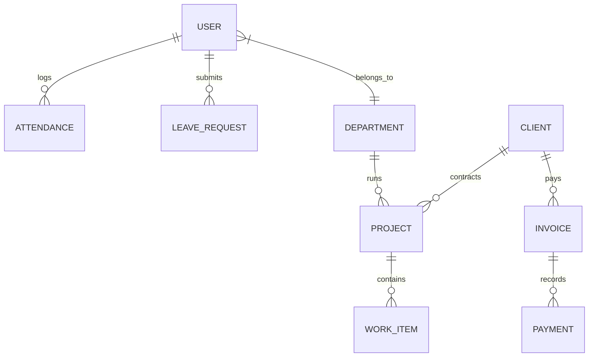

# Database Schema: We Alll Office

This document serves as the directory reference for the We Alll Office database layer. It maps all 63 Mongoose models into logical groups and specifies indexing, TTL, and relationship architectures.

---

## 1. Schema Groups

To maintain order across the 63 schemas, the models are divided into 8 logical schema groups:

### 1.1 User & Organization Core
* **`userModel.js`**: Core user accounts detailing profile info, service company alignment (We Alll vs. Kolkata Digital), role, active department, and AWS S3 picture URI.
* **`departmentModel.js`**: Department divisions mapping the department Head (HoD).
* **`activityModel.js`**: Internal system audit trails tracking user activity events.
* **`fcmTokenModel.js`**: Push notification device keys mapped to user accounts.
* **`userPermissionGrantModel.js`**: Custom overrides granting extra permissions to specific users.

### 1.2 Attendance & Leave Management
* **`attendanceModel.js`**: Clock-in and out timestamps, location GPS tags, and daily status (Present, Late, Half-day, Absent).
* **`leaveRequestModel.js`**: Leave requests, type parameters, balance counts, and multi-tier approval states.
* **`holidayModel.js`**: Listing of official company calendar holidays.
* **`wfhRequestModel.js`**: Requests for remote work shifts.
* **`workOnLeaveDayRequestModel.js`**: Logs of working during scheduled holidays/leaves.

### 1.3 Project & Work Item Management
* **`projectModel.js`**: Client project parameters, companies (We Alll vs. KD), assignments, and milestone statuses.
* **`workItemModel.js`**: The central task management schema replacing legacy slots, tracking deadlines, assignees, and progress stages.
* **`workCalendarModel.js`**: Aggregated schedules mapping department tasks and deadlines.
* **`slotModel.js` & `taskModel.js`**: Legacy schema structures maintained for historical records.

### 1.4 Sales & CRM
* **`clientModel.js`**: Detailed business profiles of onboarded clients.
* **`leadModel.js`**: Incoming sales prospects, assignment histories, calling logs, and stage transitions.
* **`rawDataModel.js`**: Bulk uploaded data sheets for caller queues.
* **`importantPersonModel.js`**: Key contact registries at client businesses.
* **`feedbackModel.js`**: Customer feedback loops.

### 1.5 Billing & Invoices
* **`invoiceModel.js`**: Invoices with multi-company headers and payment statuses.
* **`billModel.js`**: Vendor payments and procurement bills.
* **`paymentModel.js`**: Records of client invoice transaction checks.
* **`planModel.js` & `subscriptionModel.js`**: SaaS recurring subscriptions linked to client services.

### 1.6 Procurement
* **`purchaseRequestModel.js`**: Requisitions submitted by department heads.
* **`purchaseOrderModel.js`**: Approved purchase orders issued to vendors.
* **`goodsReceiptModel.js`**: Log of items delivered against purchase orders.
* **`vendorModel.js`**: Third-party supplier profiles.
* **`budgetModel.js`**: Department-specific operational spending budgets.

### 1.7 Payroll
* **`salaryStructureModel.js` & `salaryStructureTemplateModel.js`**: Earnings and deductions config matrices.
* **`salarySlipModel.js`**: Calculated monthly net salary receipts.
* **`salaryPreviewModel.js`**: Temp data structures for HR payroll draft runs.

### 1.8 Operations & Assets
* **`assetModel.js` & `assetAssignmentModel.js`**: Inventory hardware items and assignments logs.
* **`softwareLicenseModel.js`**: SaaS subscriptions tracking employee keys.
* **`documentModel.js` & `policyModel.js`**: Public agreements and internal company rule documents.
* **`notificationModel.js` & `announcementModel.js`**: In-app push logs and broad announcement messages.
* **`growthTrackModel.js`**: Notice warnings, targets progress logs, and reviews history records.

---

## 2. Entity Relationship Diagram (ERD)

The diagram below represents the core logical associations across primary schemas:

---

## 3. Indexing & TTL Policies

To optimize database query operations, specific models implement custom indexes:

1. **TTL (Time to Live) Indexes:**
   * **`notificationModel.js`**: Employs an index on `expiresAt` with `expireAfterSeconds: 0`. This automatically purges expired logs from the database.
2. **Composite Query Indexes:**
   * **`attendanceModel.js`**: Indexes `{ user: 1, date: -1 }` to quickly load an employee's chronological logs.
   * **`notificationModel.js`**: Composite index `{ recipient: 1, isRead: 1, createdAt: -1 }` optimizes the retrieval of unread notifications for navigation bells.
