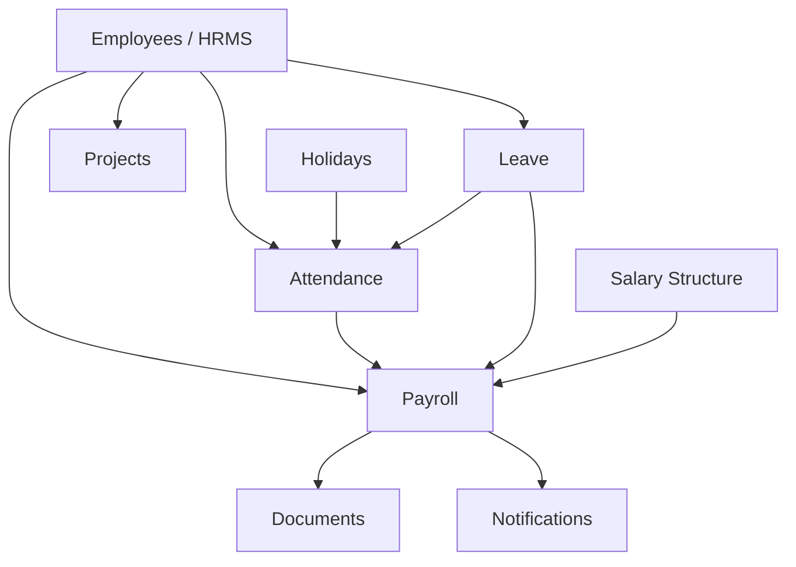

# Project Architecture: We Alll Office

This document specifies the software architecture, codebase repository structure, component data flow, external integration frameworks, and inter-module dependencies of We Alll Office.

---

## 1. Repository & Directory Structure

The repository is organized as a monorepo split into standard backend and frontend roots:

```
We-Alll-CRM-Website/
├── backend/                  # Express API Server
│   ├── src/
│   │   ├── authz/            # RBAC V2 configuration files
│   │   ├── config/           # Database, cron, and environment setups
│   │   ├── controllers/      # Route handler controllers (58 controllers)
│   │   ├── middleware/       # Route request filters (auth, rate limits)
│   │   ├── models/           # Mongoose Database schemas (63 models)
│   │   ├── routes/           # API endpoints routing definitions
│   │   ├── services/         # Third-party integrations (S3, email)
│   │   └── server.js         # Entry point for backend Express app
│   └── scripts/              # Seed scripts and administrative database tasks
├── frontend/                 # Vite Single Page React Application
│   ├── src/
│   │   ├── api/              # Axios wrappers mapping endpoints
│   │   ├── components/       # Reusable layout fragments (Sidebar, Modals)
│   │   ├── context/          # React Context providers (AuthContext)
│   │   ├── pages/            # View dashboards (Dashboard, HRMS, Projects)
│   │   ├── routes/           # Protected routing and lazy-loaded links
│   │   ├── styles/           # Vanilla CSS overrides (pip-theme.css)
│   │   ├── utils/            # Shared formatting and utility functions
│   │   └── main.jsx          # React app mount entry point
│   └── vite.config.js        # Vite build configuration settings
├── docs/                     # Modular Living Project Knowledge Base
└── deploy.sh                 # Production shell scripts for PM2/Nginx VPS
```

---

## 2. Backend Layered Flow

The backend follows a classic layered MVC design pattern for data query handling:

```
[HTTP Request] ──> [Routes] ──> [Auth/RBAC Middleware] ──> [Controllers] ──> [Mongoose Models] ──> [MongoDB Atlas]
```

1. **Routing:** Incoming HTTP requests land on `/api/<module>` routes (e.g. `backend/src/routes/leaveRoutes.js`).
2. **Gating:** Standard middleware verifies authentication (`protect`) and gates actions using RBAC permissions (`requireModulePermission`).
3. **Execution:** The Controller handles payload validation, triggers transactional database updates via Mongoose models, and returns standard JSON payloads.

---

## 3. Frontend Architecture

The client side is built as a single-page app (SPA) powered by Vite, compiling into static JS/CSS assets:

* **Routing Engine:** Configured in `frontend/src/routes/index.jsx` using `react-router-dom`. Routes are split into public (`/login`) and gated paths wrapped inside custom `<PermissionRoute>` controls.
* **Context State:** The central user state resides inside `AuthContext.jsx` which reads the browser localStorage cache token and decodes it to determine active user roles, departments, and grants.
* **Service Wrappers:** Specific page scripts call centralized Axios wrappers (e.g., `attendanceApi.js`, `growthTrackApi.js`) rather than typing raw fetch requests.

---

## 4. Integration Patterns

* **File Storage:** Local uploads pass through `multer` and are pushed to secure AWS S3 buckets (implemented inside `backend/src/services/uploadService.js`).
* **Real-time Notifications:** Mobile app push notifications utilize Firebase Cloud Messaging (FCM) tracking device tokens stored in `fcmTokenModel.js`.
* **Cron Jobs:** Scheduled tasks (attendance late reports, automated daily clock-outs, plan renewal alerts) run periodically using `node-cron` config in `backend/src/config/cronJobs.js`.

---

## 5. Cross-Module Dependency Map

Changes in one module can cascade through other services. Use this dependency matrix during change risk analysis:



| Module | Depends On | Affected By |
| :--- | :--- | :--- |
| **Attendance** | Employees, Holidays, Leaves | Shift schedule modifications, leave approval events. |
| **Leave** | Employees, Holidays | Balance updates, department head (HOD) approval flow. |
| **Payroll** | Employees, Attendance, Leaves, Salary Structures | Clock-in records, approved unpaid leaves, structure updates. |
| **Projects** | Employees, Clients, Departments | Team assignments, client contract updates. |
| **CRM/Sales** | Employees, Clients | Lead allocations, subscription terms, calling queues. |
| **Procurement** | Employees, Departments | Manager/HOD limits, budget balances, vendor profiles. |
