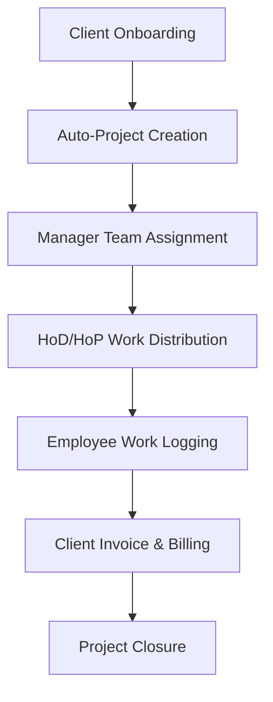

# Project Overview: We Alll Office ERP

We Alll Office is a comprehensive, enterprise-grade Customer Relationship Management (CRM) and Enterprise Resource Planning (ERP) platform designed for digital agencies, digital marketing service providers, and digital consultancies.

---

## 🏢 Business Objective & Multi-Company Model

The platform is architected to operate a dual-company business structure under a single unified dashboard, serving two distinct digital service companies:

1. **We Alll:** The primary digital marketing, content strategy, and agency consulting entity.
2. **Kolkata Digital:** The secondary technical digital service delivery and consulting branch.

The system ensures strict data segregation and structural separation between these entities, covering clients, financial invoices, purchase requests, and project portfolios while allowing shared internal operations (HR, attendance, leave structures).

---

## 👥 Target Users & Detailed Role Persona Mapping

The platform enforces a strict role hierarchy with distinct boundaries of responsibility and dashboard capability:

| Role | Persona & Business Objective | Core Dashboard Capabilities |
| :--- | :--- | :--- |
| **SuperAdmin** | The system owner. Monitors platform health, manages system-wide configurations, databases, and global variables. | Full platform visibility, tenant/system control, database metrics. |
| **Admin** | Primary company managers for We Alll and Kolkata Digital. Oversees all departments, projects, invoices, and billing. | Full company metrics, invoice generation, financial approvals, team onboarding. |
| **HR** | Human Resources personnel. Audits internal metrics, manages employees, schedules holidays, and reviews payrolls. | Attendance correction, leave finalization, employee records, payroll sheets. |
| **Manager** | Operational managers. Oversees multiple department divisions and handles project portfolios and client escalations. | Client communication queues, project workspaces, and workload analytics. |
| **HoD (Head of Dept)** | Department division leaders. Manages department performance, approvals, and logs. | Department attendance logs, leave request pre-approvals, and work assignments. |
| **HoP (Head of Project)** | Dedicated project leads. Coordinates task delivery across project team members. | Project timelines, milestones, and task workload tracking. |
| **Employee** | Standard agency team member. Logs daily work items, tracks hours, and manages tasks. | Clock in/out widget, personal tasks board, leave request form, and Growth Track dashboard. |
| **Client** | External agency clients. Reviews deliverables, subscription payments, and invoices. | Subscriptions tab, project progress charts, and invoice PDF exports. |

---

## ⚡ High-Level Technology Stack

The platform is built using the robust and modular **MERN** stack:

* **Frontend:** React 18, Vite 5+, React Bootstrap 5 (responsive grids), React Router v6, Axios (HTTP/Interceptors), Context API (Auth state).
* **Backend:** Node.js 21.7.3+, Express.js, JWT (Secured auth tokens), Bcrypt (Password hashing), Multer & AWS S3 integration.
* **Database:** MongoDB Atlas (Cloud clustering) and Mongoose ODM for logical schema modeling.
* **Infrastructure:** Ubuntu Linux, Nginx (Reverse Proxy & SSL), PM2 Process Manager, and Winston Logger.

---

## 🔄 Core Business Workflows

The platform coordinates operations through automated, interconnected flows:

1. **Onboarding & Project Generation:** When an Admin creates a new Client record and links a service, a matching Project is automatically generated.
2. **Work Allocation:** Managers assign team members to the Project, and HoDs distribute individual Work Items.
3. **Execution & Log Auditing:** Employees log work on their dashboard. HODs review hours and verify attendance records.
4. **Billing Synchronization:** Invoice records are dynamically generated based on active client subscriptions, billable hours, and project milestones.
